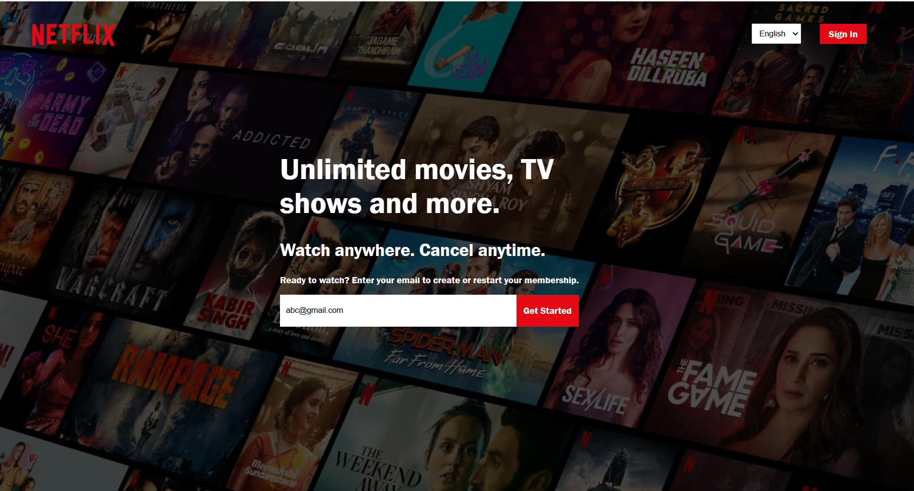

# netflix-login-page
A simple, static replica of the Netflix login page built with HTML and CSS. This project serves as a demonstration of how to create a responsive web page layout featuring a navigation bar, promotional content, and a user input form. Perfect for anyone learning the basics of web development, or those looking to practice their front-end skills.
Features
Responsive Layout: The design adapts to different screen sizes (desktop, tablet, mobile).
Navigation Bar: Includes a Netflix logo, language dropdown, and "Sign In" button.
Main Content Section: Includes promotional text and an email input field for user registration.
Background Image: Uses a background image for a realistic Netflix experience.

Tech Stack
HTML: For the structure of the page.
CSS: For styling and layout adjustments.
JavaScript: (Optional for further enhancements)

Project Structure
bash
Copy
Edit
netflix-dummy-login/
│
├── index.html       # Main HTML file
├── style.css        # Stylesheet for the page
└── Images/          # Folder containing images (logo, background)
    └── logo.png     # Netflix logo
    └── image.jpg    # Background image

Here's how it looks

